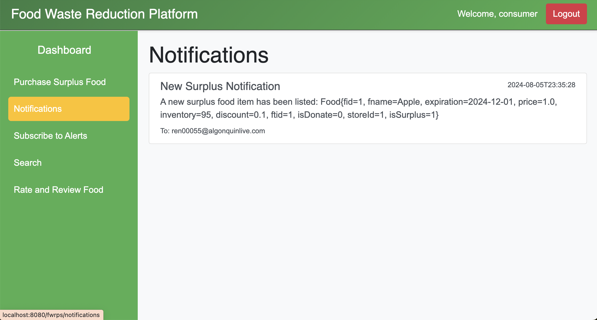

# Food Waste Reduction Platform

## 1. Retailer Dashboard
- **Description:** This image shows the "Retailer Dashboard" page. The dashboard provides a summary of the retailer's profile and key statistics such as the total listed items, total sold items, total revenue, and total donated items. The page is designed to give retailers an overview of their food-related activities.

## 2. Retailer Manage Inventory
- **Description:** This image displays the "Manage Inventory" page for retailers. Retailers can manage their food inventory, including viewing item names, quantities, expiration dates, prices, and discounts. The page provides options to edit or delete inventory items and includes a checkbox to filter items based on expiration dates.

## 3. Retailer Surplus Food
- **Description:** This image showcases the "Identify Surplus Food" page for retailers. Retailers can view a list of food items with details such as quantity, expiration date, and whether the item has been identified as surplus or declared as donated. The interface includes an "Identify" button for each item to mark it as surplus food.

## 4. Retailer View Feedback
- **Description:** This image depicts the "Submitted Feedback" page where retailers can view feedback left by consumers. Feedback is organized by food item and includes ratings and comments. This page helps retailers understand customer satisfaction with their products.

## 5. Organization Dashboard
- **Description:** This image displays the "Organization Dashboard" page. The dashboard provides organizations with a summary of their activities, including total claims and the most claimed food item. The interface is designed to help organizations track their impact on reducing food waste.

## 6. Organization Claim Food
- **Description:** This image illustrates the "Claim Food" page for organizations. Organizations can claim surplus food items by selecting them from the list. Each item displays relevant details such as quantity and expiration date, with a "Claim" button available for each item.

## 7. Organization Feedback
- **Description:** This image represents the "Feedback" page for organizations. Organizations can submit feedback for specific food items by providing a rating and comments. The interface includes a dropdown menu to select the food item, a rating scale, and a text area for comments. Submitted feedback is displayed below.

## 8. Consumer Dashboard
- **Description:** This image showcases the "Consumer Dashboard" page. The dashboard provides a summary of the consumer's activity, including total orders, total expenditure, total feedback given, and their favorite food item. The interface is designed to give consumers an overview of their interactions with the platform.

## 9. Consumer Purchase
- **Description:** This image illustrates the "Purchase Surplus Food" page for consumers. Consumers can purchase surplus food items listed on the platform. Each item is displayed with details such as quantity and expiration date, along with a "Purchase" button to complete the transaction.

## 10. Consumer Notification
- **Description:** This image represents the "Notifications" page for consumers. Consumers can view notifications about surplus food items, including details such as item name, expiration date, and inventory. Notifications keep consumers informed about new surplus items available for purchase.

#Explore more of my projects and professional journey on [LinkedIn](https://www.linkedin.com/in/xihai-ren/) and [GitHub](https://github.com/RyanRen2023)

#   

---